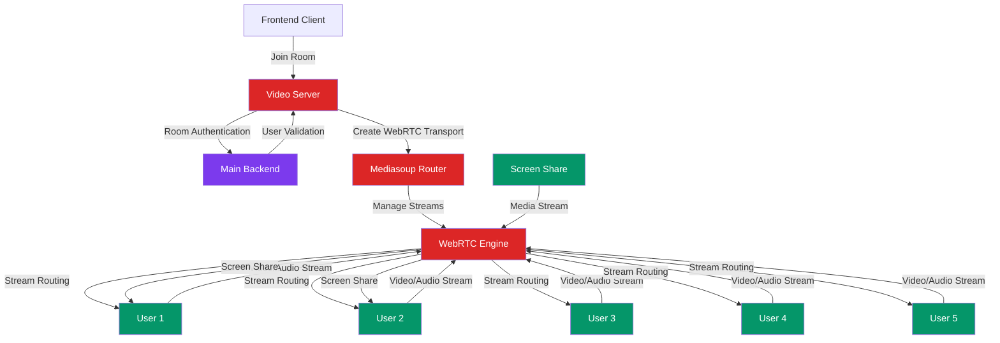

# 🎥 **DirectCode UI - Real-time Video chat Server**

### *WebRTC Video Communication & Screen Sharing*

<p align="center">
  <a href="https://www.directcodeui.in/"></a>
  <a href="https://github.com/Yash-Yadav-901/Direct-Code-Dev"></a>
  
  
  
</p>

## 🌟 About This Service

**Real-time Video Server** powers the video communication features of DirectCode UI, enabling:
- 🎥 **Multi-user video/audio calls** (up to 5 participants)
- 📺 **Screen sharing** for collaborative reviews
- 🎤 **Audio controls** (mute/unmute)
- 📹 **Camera controls** (on/off)
- 🔒 **Room-based communication** for secure sessions

Part of the DirectCode UI ecosystem.

---

## 🎯 Key Features

| Feature | Description |
|---------|-------------|
| 🎥 **WebRTC Video Calls** | High-quality peer-to-peer video communication |
| 📺 **Screen Sharing** | Share entire screen or application windows |
| 🎤 **Audio Management** | Individual mute/unmute controls |
| 📹 **Camera Controls** | Enable/disable camera per user |
| 👥 **Room Management** | Secure video rooms for collaboration |
| 🔄 **Real-time Sync** | Instant participant state updates |
| 📱 **Mobile Support** | Responsive video experience |

---

## 🏗 System Architecture



---

## 🛠 Tech Stack

| Layer | Technology |
|-------|------------|
| **WebRTC Framework** | Mediasoup |
| **Backend Runtime** | Node.js |
| **Signaling** | Socket.io |
| **Room Management** | Custom room controller |
| **Deployment** | Hostinger VPS |
| **Protocol** | RTP, SCTP |

---

## 🚀 Quick Start

### Prerequisites
- Node.js (v18 or higher)
- SSL certificates (for production)
- OpenSSL support

### Installation

```bash
# Clone repository
git clone https://github.com/Yash-Yadav-901/Direct-Code-Ui-Real-time-V-server
cd Direct-Code-Ui-Real-time-V-server

# Install dependencies
npm install

# Environment setup
cp .env.example .env
# Configure your environment variables
```

### Environment Variables
```env
PORT=5004
NODE_ENV=development
MAIN_BACKEND_URL=your_main_backend_url
SSL_CERT_PATH=path/to/certificate
SSL_KEY_PATH=path/to/private/key
MEDIASOUP_LISTEN_IP=0.0.0.0
MEDIASOUP_ANNOUNCED_IP=your_server_ip
```

### Start Development Server
```bash
npm run dev
```

---

## 📡 WebSocket Events

### Room Management
```javascript
// Join video room
socket.emit('join-video-room', {
  roomId: 'room_123',
  userId: 'user_456',
  userData: { name: 'John', avatar: '...' }
});

// Leave video room
socket.emit('leave-video-room', {
  roomId: 'room_123',
  userId: 'user_456'
});
```

### Media Controls
```javascript
// Toggle audio
socket.emit('toggle-audio', {
  roomId: 'room_123',
  enabled: false
});

// Toggle video
socket.emit('toggle-video', {
  roomId: 'room_123',
  enabled: true
});

// Screen share
socket.emit('start-screen-share', {
  roomId: 'room_123'
});
```

### Participant Events
```javascript
// New participant joined
socket.on('participant-joined', (data) => {
  console.log('User joined:', data.user);
});

// Participant left
socket.on('participant-left', (data) => {
  console.log('User left:', data.userId);
});

// Media state changed
socket.on('media-state-changed', (data) => {
  console.log('User', data.userId, 'video:', data.video, 'audio:', data.audio);
});
```

---

## 🔧 Configuration

### Mediasoup Settings
```javascript
const mediasoupConfig = {
  // Router settings
  routerOptions: {
    mediaCodecs: [
      {
        kind: 'audio',
        mimeType: 'audio/opus',
        clockRate: 48000,
        channels: 2
      },
      {
        kind: 'video',
        mimeType: 'video/VP8',
        clockRate: 90000,
        parameters: {
          'x-google-start-bitrate': 1000
        }
      }
    ]
  },
  
  // WebRTC transport settings
  webRtcTransportOptions: {
    listenIps: [
      {
        ip: '0.0.0.0',
        announcedIp: 'YOUR_SERVER_IP'
      }
    ],
    enableUdp: true,
    enableTcp: true,
    preferUdp: true
  }
};
```

### Room Limits
```javascript
const roomConfig = {
  maxParticipants: 5,
  maxDuration: 7200000, // 2 hours
  allowScreenShare: true,
  requireAuth: true
};
```

---

## 🏗 Integration with Main System

### Authentication Flow
1. **User joins** collaboration room in main app
2. **Main backend** validates room permissions
3. **Video server** authenticates user via main backend
4. **WebRTC connection** established for video/audio

### Room Synchronization
```javascript
// Sync with main collaboration room
socket.on('room-sync', (data) => {
  // Update room participants
  // Sync user permissions
  // Handle host privileges
});
```

---

## 📊 Monitoring & Health

### Health Check Endpoint
```http
GET /health

Response: {
  status: "healthy",
  service: "video-server",
  activeRooms: 5,
  activeConnections: 23,
  uptime: 123456
}
```

### Room Statistics
```javascript
// Get room stats
socket.emit('get-room-stats', { roomId: 'room_123' });

// Response
{
  participants: 3,
  hasScreenShare: true,
  roomCreated: "2024-01-15T10:30:00Z",
  videoEnabled: [true, true, false],
  audioEnabled: [true, false, true]
}
```

---

## 🐛 Troubleshooting

### Common Issues
- **WebRTC connection fails**: Check SSL certificates and firewall
- **Audio/video not working**: Verify browser permissions
- **Screen share not available**: Ensure HTTPS in production
- **High latency**: Check network conditions and server location

### Debug Mode
```bash
DEBUG=mediasoup:* npm run dev
```

---

## 🔗 Related Services

| Service | Purpose | Repository |
|---------|---------|------------|
| 🎨 **Frontend** | User interface | [Direct-Code-Dev](https://github.com/Yash-Yadav-901/Direct-Code-Dev) |
| ⚙️ **Backend** | Main API server | [Direct-Code-Dev](https://github.com/Yash-Yadav-901/Direct-Code-Dev) |
| 👥 **Realtime** | Collaboration features | [Realtime Repo](https://github.com/Yash-Yadav-901/Direct-Code-UI-Real-time-) |
| 🤖 **GenAI** | Code generation | [GenAI Repo](https://github.com/Yash-Yadav-901/Direct-Code-UI-GenAIandLogTracking-) |
| 🔍 **Extension** | UI capture tool | [Extension Repo](https://github.com/Yash-Yadav-901/Direct-Code-Dev-UI-UX-Capturing-Extension-) |

---

## 🤝 Contributing

1. Fork the repository
2. Create feature branch (`git checkout -b feature/improvement`)
3. Commit changes (`git commit -m 'Add video feature'`)
4. Push to branch (`git push origin feature/improvement`)
5. Open a Pull Request

---

## 📜 License

MIT © 2025 DirectCode UI

---

## 👨‍💻 Maintainer

**Yash Yadav**  
3rd Year B.Tech CSE  
Building real-time collaboration tools ⚡

---

<div align="center">

### ⭐ **Part of the DirectCode UI Ecosystem**

**Main Project**: [DirectCode UI](https://github.com/Yash-Yadav-901/Direct-Code-Dev)

**Experience seamless video collaboration while coding!** 🎥💻

</div>
